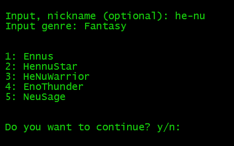

# Character name generator that supports *all* genres

The internet is full of different character generators, but why should you need to settle for pre-generated lists of names, browsing from site to site trying to find the best ones, when you could generate new names with a language model? Input *anything* as your preferred genre and optionally prompt with your existing nickname that you want to use as inspiration for the model.

## State of the art UX



## Run installation script

Installs a virtual environment and all of the requirements to run the application inside it. Opens the virtual environment.

``` bash
source auto_install.sh
```

### Run main

``` bash
python3 main.py
```

### Disclaimer

Do not take this too seriously. It's for fun.
